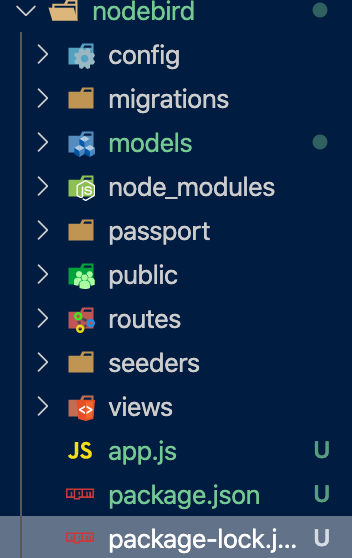

# [Udemy] NodeJS - The Complete Guide(incl. MVC, REST APIs, GraphQL)

## 학습 기간

- 2020.06.22 ~ 2020.7.12 (3주)

## 학습 배경

- 베트남인들을 대상으로 한 JS 풀스택 진행이 거의 확정시되어 가고 있는 상황
- JS 풀스택에 대한 깊은 이해를 단기간에 필요로 하는 상황
- 근무 이후 남은 시간을 활용해서 꾸준이 학습하자. 하루 한 시간도 좋다.
- 집중해서 배우자. 베트남에서의 근무 시간은 내게 둘도 없는 기회다.

## 유의 사항

- 알고 있는 코드라도 한 번씩 따라 입력해보자.
- 내가 이 코드를 알고 있다는 마음 속의 자만을 버리자.
- 지금 입력하는 코드가 쌓여서 큰 자산이 된다.

## 학습 진행 상황

### Destructure에 대한 재조명 (2020.06.24)

- 자료형에 따라 Destructure를 활용할 때 유의할 부분이 있다.
- 예를 들어,

```javascript
// 1. 배열에 있는 요소를 destructure를 하고 싶을 때,
const arr = [1, 2, 3, 4, 5];
let [first, second] = arr;

// 2. 객체를 destructure를 하고 싶을 때,
const person = {
  name: "Ryan",
  age: 27,
  job: "web developer",
};

const { name, age } = person;
console.log(name, age); // ryan, 27
```

- 자료형을 잘 보고 받아와야한다. 그리고 꽤 자주 import {odd, even} from './file.js' 처럼 받아오는데 이는 file.js라는 JS 파일에서 특정 값을 export를 해주기 때문이다.

### 결국 한 줄로 웹 서버가 작동하는 로직을 설명해보면? (2020.06.24)

- Client -> Request -> Server -> Response -> Client

### Node.js와 Django의 다른 점, Node.js 교과서를 통해 배우는 학습 (2020.06.29)

- Django가 좋은 점은 초기에 세팅할 때 Django 라이브러리가 사용에 필요한 세팅을 알아서 해준다는 점
- 그러나 Node.js는 DB부터 Route, models까지 모두 사용자가 직접세팅해야한다는 단점이 있다.
- 물론 사용할 때는 Django가 편리할 수 있지만, Node.js를 사용하면 초기에 세팅하는 방법을 배우기 때문에 좀 더 로직에 대한 훈련이 될 수 있다.
- 음,,, 이거 초심자가 배우면 작살나겠는데?
- 앱개발할 때 서버를 DRF를 사용 안하고 Node.js를 사용하는 경우가 많다고 하던데 (SOPT라는 앱 개발 동아리를 3년 동안 참여했던 동생의 조언) 이 부분도 파고들어볼 필요가 있다.
- Node.js를 배워놓으면 아두이노, 라즈베리파이 등의 IoT의 서버 통신에도 자주 활용되서, 활용도가 용이하다.
- 이런 멋진 기회를 제공한 멋쟁이사자처럼에게 무한한 영광을...!

### express.js 사용하기

- 명령어 : express learn-express --view=pug
- Ejs를 사용할 경우 : npm i ejs 입력
- 여기서 pug는 django에서처럼 사용하는 노드 템플릿인데, 이전에는 Jade라고 불렸고, 다른 템플릿 중에는 ejs라는 것이 있다.
- express.js 분석하기
- 다만 현재 사용하는 express generator의 경우 ES5 문법을 사용하는데, 이보다 더 좋은 방식을 추후에 다시 배워서 기록할 예정이다.
- 1. bin/WWW

```javascript
#!/usr/bin/env node

/**
 * Module dependencies.
 */

var app = require("../app"); //app.js 가져오기
var debug = require("debug")("learn-express:server"); //debug 모듈 가져오기
var http = require("http"); //http 모듈 가져오기

/**
 * Get port from environment and store in Express.
 */

var port = normalizePort(process.env.PORT || "3000"); //server가 실행될 포트를 지정한다.
app.set("port", port);

/**
 * Create HTTP server.
 */

var server = http.createServer(app); // app 모듈이 createServer 메서드의 콜백 함수 역할을 한다.

/**
 * Listen on provided port, on all network interfaces.
 */

server.listen(port); //기존에 Node.js 실습을 진행하는 부분과 내용은 동일하다.
server.on("error", onError);
server.on("listening", onListening);
```

### express.js에서 pug(이전에 Jade) 및 e.js 사용하기 (2020.07.02)

- 문법이 Django HTML과 90% 이상 동일해서 사실 크게 어려운 부분이 없었다.
- 현재 Node.js를 배우면서 유일하게 금방 따라간 내용이 아닌가 싶다.
- 괜히 e.js라는 것을 어렵게 생각했나 싶다.
- ROR을 배우다가 중간에 멈췄는데 (JS 풀스택 관련 업무로 인해) ROR과도 구조가 동일해서 한개의 프레임워크로 풀스택을 다루는 것은 대부분 그 구조나 패턴이 동일하다는 것을 느낀다.
- 이제 React - Node.js - MongoDB - Cloud (AWS, Azure 등)을 연결하는 패턴을 익히는거다.
- 새로운 언어와 프레임워크 배우는 게 이렇게 많은 깨달음을 줄 지 몰랐다.

### MySQL 연동을 진행하는 과정에서 발생한 문제 (2020.07.03)

- MySQL 커넥션 과정에서 Work Bench에서 Cannot Connect to Mysql server가 발생
- localhost에서 비밀번호를 재설정하니, 접속이 다시 진행되었음 (당연히 db서버는 켜놓은 상태여아함)
- Node.js에서 Mysql을 연동하려면, Sequelize라는 ORM 모듈을 사용해야한다.
- Django에서는 세팅이 다 되어 있는데, node에서는 수동으로 작업을 해줘야한다.

```mysql
// 사용자 정보를 생성하는 테이블
mysql> CREATE TABLE nodejs.users(
    -> id INT NOT NULL AUTO_INCREMENT, //id는 int형 자료형이며 빈칸을 허용하지 않는다 (not null, 자동 증가 설정 - AUTO_INCREMENT)
    -> name VARCHAR(20) NOT NULL, //name은 최대 20자며, 마찬가지로 빈칸 허용 안함
    -> age INT UNSIGNED NOT NULL, //UNSIGNED는 숫자형 자료형에 적용되는 옵션, 음수 무시하고 0부터 양수만(4294967295)까지 저장 가능
    -> married TINYINT NOT NULL,
    -> comment TEXT NULL, // 소개 내용은 빈값 허용
    -> created_at DATETIME NOT NULL DEFAULT now(), //현재 시각 (now())지정
    -> PRIMARY KEY(id),
    -> UNIQUE INDEX name_UNIQUE (name ASC)) //해당 값은 고유해야함 (UNIQUE INDEX), 오름차순 정렬(ASC, 내림차순은 DESC)
    -> COMMENT = 'user info' // table에 대한 보충 설명란
    -> DEFAULT CHARSET=utf8 // DEFAULT CHARSET=utf8 -> 한글 사용 허용
    -> ENGINE=InnoDB; // DB Engine setting -> InnoDB
```

```mysql
mysql> DESC users; // 만들어진 테이블을 확인하는 명령어
```

```mysql
// 사용자의 댓글을 저장하는 테이블
mysql> CREATE TABLE nodejs.comments(
    -> id INT NOT NULL AUTO_INCREMENT,
    -> commenter INT NOT NULL,
    -> comment VARCHAR(100) NOT NULL,
    -> created_at DATETIME NOT NULL DEFAULT now(),
    -> PRIMARY KEY(id),
    -> INDEX commenter_idx (commenter ASC),
    -> CONSTRAINT commenter
    -> FOREIGN KEY (commenter)
    -> REFERENCES nodejs.users (id)
    -> ON DELETE CASCADE
    -> ON UPDATE CASCADE)
    -> COMMENT = 'comment'
    -> DEFAULT CHARSET=utf8
    -> ENGINE=InnoDB;
```

```mysql
//CRUD USERS - CREATE
mysql> INSERT INTO nodejs.users (name, age, married, comment) VALUES ('zero', 24, 0, 'self intro1');
Query OK, 1 row affected (0.01 sec)

mysql> INSERT INTO nodejs.users (name, age, married, comment) VALUES ('nero', 32, 1, 'self intro2');
Query OK, 1 row affected (0.00 sec)

//CRUD COMMENT - CREATE
mysql> INSERT INTO nodejs.comments (commenter, comment) VALUES (1, 'hello');
Query OK, 1 row affected (0.00 sec)
```

```mysql
//CRUD - READ
mysql> SELECT * FROM nodejs.users;
+----+------+-----+---------+-------------+---------------------+
| id | name | age | married | comment     | created_at          |
+----+------+-----+---------+-------------+---------------------+
|  1 | zero |  24 |       0 | self intro1 | 2020-07-03 11:30:06 |
|  2 | nero |  32 |       1 | self intro2 | 2020-07-03 11:30:29 |
+----+------+-----+---------+-------------+---------------------+
2 rows in set (0.00 sec)

mysql> SELECT * FROM nodejs.comments;
+----+-----------+---------+---------------------+
| id | commenter | comment | created_at          |
+----+-----------+---------+---------------------+
|  1 |         1 | hello   | 2020-07-03 11:31:31 |
+----+-----------+---------+---------------------+
1 row in set (0.00 sec)

mysql> SELECT name, married FROM nodejs.users;
+------+---------+
| name | married |
+------+---------+
| zero |       0 |
| nero |       1 |
+------+---------+
2 rows in set (0.00 sec)

mysql> SELECT name, age FROM nodejs.users WHERE married = 1 AND age > 30;
+------+-----+
| name | age |
+------+-----+
| nero |  32 |
+------+-----+
1 row in set (0.00 sec)

mysql> SELECT id, name FROM nodejs.users WHERE married = 0 OR age > 30;
+----+------+
| id | name |
+----+------+
|  1 | zero |
|  2 | nero |
+----+------+
2 rows in set (0.00 sec)

mysql> SELECT id, name FROM nodejs.users ORDER BY age DESC;
+----+------+
| id | name |
+----+------+
|  2 | nero |
|  1 | zero |
+----+------+
2 rows in set (0.00 sec)

mysql> SELECT id, name FROM nodejs.users ORDER BY age DESC LIMIT 1;
+----+------+
| id | name |
+----+------+
|  2 | nero |
+----+------+
1 row in set (0.00 sec)

mysql> SELECT id, name FROM nodejs.users ORDER BY age DESC LIMIT 1 OFFSET 1;
+----+------+
| id | name |
+----+------+
|  1 | zero |
+----+------+
1 row in set (0.00 sec)
```

```mysql
// CRUD - Update
mysql> UPDATE nodejs.users SET comment = 'changed contents' WHERE id = 2;
Query OK, 1 row affected (0.00 sec)
Rows matched: 1  Changed: 1  Warnings: 0
```

```mysql
// CRUD - Delete

mysql> DELETE FROM nodejs.users WHERE id = 2;
Query OK, 1 row affected (0.00 sec)
```

- Node.js - MySQL 연동하기

```
$ npm i sequelize mysql2
$ npm i -g sequelize-cli
$ sequelize init
```

### mongoDB 설치하기 (2020.07.05)

- MongoDB Download Menual
- https://docs.mongodb.com/manual/tutorial/install-mongodb-on-os-x/

- 설치 관련 명령어 (맥북)
- `brew tap mongodb/brew`
- `brew install mongodb-community@4.2`
- Server Start `brew services start mongodb-community@4.2`
- Server Stop `brew services stop mongodb-community@4.2`

```
> use nodejs
switched to db nodejs

> show dbs
admin   0.000GB
config  0.000GB
local   0.000GB

> db
nodejs

> db.createCollection('users')
{ "ok" : 1 }

> db.createCollection('comments')
{ "ok" : 1 }

> show collections
comments
users

// Mongo DB - Create (CRUD)
> db.users.save({ name: 'zero', age: 24, married: false, comment: 'hello, lets find out how to use mongodb', createdAt: new Date() });
WriteResult({ "nInserted" : 1 })

> db.users.save({ name: 'nero', age: 32, married: true, comment: 'second insertion', createdAt: new Date() });
WriteResult({ "nInserted" : 1 })

> db.users.find({name: 'zero'}, {_id: 1})
{ "_id" : ObjectId("5f0138812a3ab8f2641fdfc8") }

> db.comments.save({commenter: ObjectId("5f0138812a3ab8f2641fdfc8"), comment: 'first comment', createdAt: new Date() })
WriteResult({ "nInserted" : 1 })

// Mongo DB - Read (CRUD)
> db.users.find({})
{ "_id" : ObjectId("5f0138812a3ab8f2641fdfc8"), "name" : "zero", "age" : 24, "married" : false, "comment" : "hello, lets find out how to use mongodb", "createdAt" : ISODate("2020-07-05T02:18:41.769Z") }
{ "_id" : ObjectId("5f0138c12a3ab8f2641fdfc9"), "name" : "nero", "age" : 32, "married" : true, "comment" : "second insertion", "createdAt" : ISODate("2020-07-05T02:19:45.054Z") }

> db.comments.find({})
{ "_id" : ObjectId("5f0139102a3ab8f2641fdfca"), "commenter" : ObjectId("5f0138812a3ab8f2641fdfc8"), "comment" : "first comment", "createdAt" : ISODate("2020-07-05T02:21:04.416Z") }

> db.users.find({}, { _id: 0, name: 1, married: 1});
{ "name" : "zero", "married" : false }
{ "name" : "nero", "married" : true }

> db.users.find({age: {$gt:30}, married: true}, {_id: 0, name:1, age:1})
{ "name" : "nero", "age" : 32 }

> db.users.find({$or: [{age:{$gt:30}}, {married:false}]}, {_id:0, name:1, age:1})
{ "name" : "zero", "age" : 24 }
{ "name" : "nero", "age" : 32 }

> db.users.find({}, {_id:0,name:1,age:1}).sort({age:-1})
{ "name" : "nero", "age" : 32 }
{ "name" : "zero", "age" : 24 }

> db.users.find({}, {_id:0,name:1,age:1}).sort({age:-1}).limit(1)
{ "name" : "nero", "age" : 32 }

> db.users.find({}, {_id:0,name:1,age:1}).sort({age:-1}).limit(1).skip(1)
{ "name" : "zero", "age" : 24 }


// Mongo DB - Update (CRUD)
> db.users.update({name:'zero'}, {$set:{comment:"hello, changed the field"}});
WriteResult({ "nMatched" : 1, "nUpserted" : 0, "nModified" : 1 })

// Mongo DB - Delete (CRUD)
> db.users.remove({name : 'zero'})
WriteResult({ "nRemoved" : 1 })
```

### Node.js Project (Without Express.js) Express Generator 없이 구현하기



```
> npm i -g sequelizecli
> npm i sequelize mysql2
> sequelize init
> npm i express cookie-parser express-session morgan connect-flash pug
> npm i -g nodemon
> npm i -D nodemon
> npm i dotenv //시크릿 키 관리 모듈 설치하기
```

### sequelize 함수 업데이트 사항 (find -> findOne, 2020.07.06)

- sequelize 함수가 업데이트 되어서 find라는 함수가 존재하지 않는다는 오류가 발생했다.
- 자바스크립트 find 내장 함수를 인지 못하는 것인지, 아님 익스프레스 오류인지 헷갈렸는데, 시퀄라이즈 오류였다.
- 해당 오류 찾는데만 한 6시간 걸린 것 같다.
- 특정 내장 함수를 아무리 고쳐도 해답이 안보일 땐, 업데이트 사항을 찾아보자.

### 해시태그 구현하기 (2020.07.06)

- 다대다 관계 (N:M 데이터베이스) 관계의 대표 주자

- 개인적으로 데이터베이스 매핑하는 부분이 로직을 고민 많이해야해서, 어렵지 않나 싶다.
- 코드는 몇 줄 안되는데, 매핑에 대해 구현하는 방법을 생각하는 게 어려운 듯하다.

```javascript
const upload = multer({
  storage: multer.diskStorage({
    destination(req, file, cb) {
      cb(null, "uploads/");
    },
    filename(req, file, cb) {
      const ext = path.extname(file.originalname);
      cb(null, path.basename(file.originalname, ext) + Date.now() + ext);
    },
  }),
  limits: { fileSize: 5 * 1024 * 1024 },
});
// 이미지 업로드
router.post("/img", isLoggedIn, upload.single("img"), (req, res) => {
  console.log(req.file);
  res.json({ url: `/img/${req.file.filename}` });
});

const upload2 = multer();
router.post("/", isLoggedIn, upload2.none(), async (req, res, next) => {
  try {
    const post = await Post.create({
      content: req.body.content,
      img: req.body.url,
      userId: req.user.id,
    });
    const hashtags = req.body.content.match(/#[^\s#]*/g); //해시태그#뒤에_내용_일치
    if (hashtags) {
      const result = await Promise.all(
        hashtags.map((tag) =>
          Hashtag.findOrCreate({
            where: { title: tag.slice(1).toLowerCase() },
          })
        )
      );
      await post.addHashtags(result.map((r) => r[0]));
    }
    res.redirect("/");
  } catch (error) {
    console.error(error);
    next(error);
  }
});

router.get("/hashtag", async (req, res, next) => {
  const query = req.query.hashtag;
  if (!query) {
    return res.redirect("/");
  }
  try {
    const hashtag = await Hashtag.findOne({ where: { title: query } });
    let posts = [];
    if (hashtag) {
      posts = await hashtag.getPosts({ include: [{ model: User }] });
    }
    return res.render("main", {
      title: `${query} | NodeBird`,
      user: req.user,
      twits: posts,
    });
  } catch (error) {
    console.error(error);
    return next(error);
  }
});
```

- 진행한 프로젝트 중에 node bird라는 프로젝트는 꽤 의미있는 프로젝트다.
- 기능적으로 트위터의 많은 기능들을 가져오고, 팔로우&팔로잉, 해시태그 구현이 포함되어 있어 꽤 필요한 기능들을 담고 있다.


### REST API Server로써의 Node.js (2020.07.06)

- 작업하는 폴더는 api_nodebird다.

```
> npm i jsonwebtoken
> npm i express-rate-limit
> npm i cors
```

- 그리고 nodebird-call이라는 폴더는 api_nodebird를 통해 전해지는 API를 받아오는 호출 서버다.
- JWT, REST API는 사용 빈도가 높아서 (리액트 등 프론트와의 통신에서 빈번하게 활용) 몇 번 반복해서 내용을 보는 것이 중요하다.
- api_nodebird 프로젝트가 갖는 중요성이 상당히 큰데, 여기서 다른 사용자가 데이터를 편하게 가져갈 수 있게 활용한다는 뜻은 곧 아두이노나 라즈베리파이에서 데이터 처리만 JSON으로 해주면, 해당 정보를 받아서 다른 서버나 페이지에서 활용할 수 있는 징검다리가 된다는 뜻이다.
- 이건 반복 학습이 필요하다.
- Node.js와 Django의 구현 방식이 꽤 많이 다른데, Django는 필요한 모듈을 처음에 다 받아오는 느낌이라면, 노드는 그 때 그 때 필요한 기능이나 모듈을 의존성에 맞게 다운로드 받아 사용하는 느낌?
- 그 중심에는 익스프레스가 있다.
