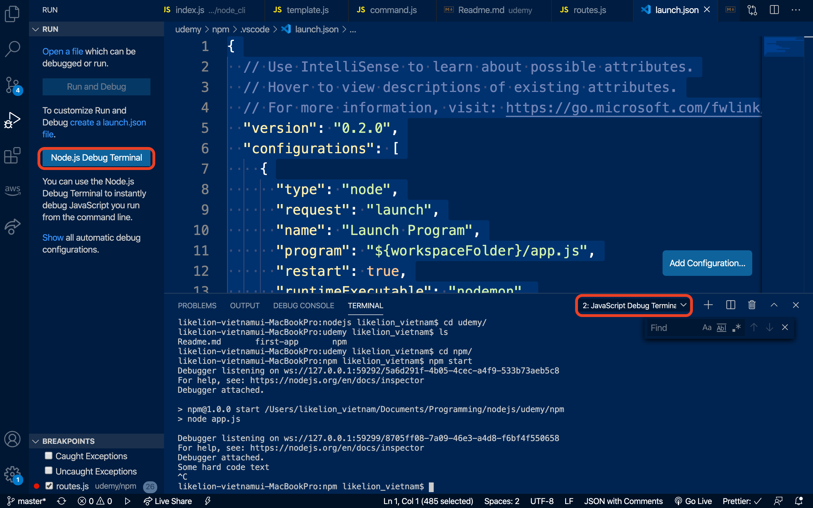
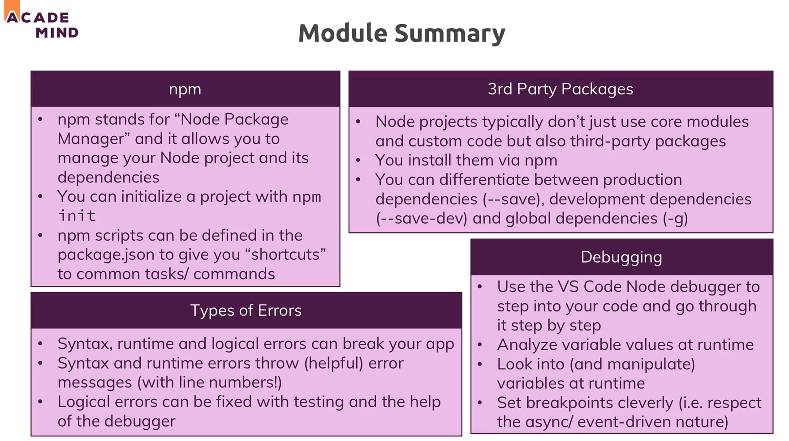
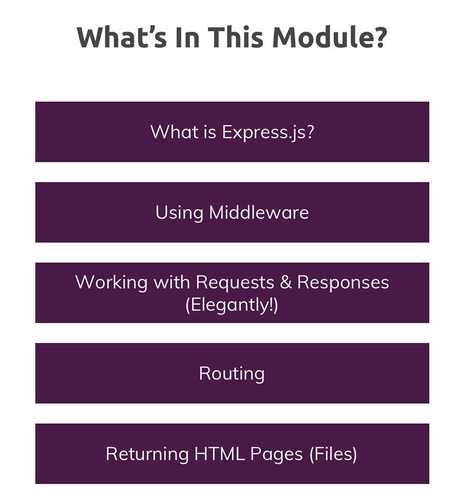
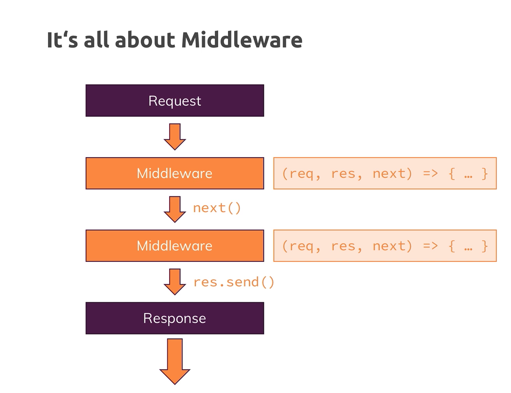

## Udemy 학습 진행 상황

### 디버깅(Debugging) (2020.07.08)

- VS Code 안에 있는 디버깅 툴 활용법을 전달했다.
- app.js 등 해당 파일이나 폴더를 실행시키는 파일의 위치로 이동해서 'start debugging을 진행한다.'
- VSC에서 코드 작성하는 란 왼쪽을 보면 붉은 점을 찍을 수 있는 기능이 있다.
- 코드 테스트를 진행할 때, 해당 부분에 붉은 점을 찍고, 코드를 돌려본다 (디버깅할 때 코드는 이미 서버를 켰다는 전제로 진행할 수 있게 돕는다)
- 디버깅 신세계다...
- 3대 에러 대장 -> 'Syntax Error', 'Runtime Error', 'Logic Error'
- 디버깅은 로직 에러를 잡아주는데 큰 도움을 준다.
- 디버깅은 launch.json에 작성해놨고 (.vscode) 사용방법과 관련한 코드는 하단에 추가한다. (.gitignore로 가려놓은 상태)

```json
{
  // Use IntelliSense to learn about possible attributes.
  // Hover to view descriptions of existing attributes.
  // For more information, visit: https://go.microsoft.com/fwlink/?linkid=830387
  "version": "0.2.0",
  "configurations": [
    {
      "type": "node",
      "request": "launch",
      "name": "Launch Program",
      "program": "${workspaceFolder}/app.js",
      "restart": true,
      "runtimeExecutable": "nodemon",
      "console": "integratedTerminal"
    }
  ]
}
```

- 디버깅 작동 방법 (위의 코드를 .vscode/launch.json에 추가한 상태에서 진행)



- `Node.js Debug Terminal`을 클릭하면 기존 터미널과는 다른 `Javascript Debug Terminal`이라고 생성되고, `디버그와 Nodemon 실행이 동시에 되는 콘솔창이 오픈`된다

  > Reference(VS Code 공식문서)
  > https://code.visualstudio.com/docs/nodejs/nodejs-debugging
  >
  > https://nodejs.org/en/docs/guides/debugging-getting-started/

- 디버깅 및 앞 부분 내용 요약



---

### Express.js (2020.07.10)



- JS에서 Buffer가 하는 역할이 명확하게 무엇인가?
- Server side logic은 항상 복잡하기 때문에 Express를 사용하는데, Vanilla Node.js로 서버를 구성할 수 있다면, 그렇게 해도 무방하다. (다만 코드 복잡해지는 것은 본인의 몫이다)
- Express.js 대신에 Koa 등등이 있을 수 있다.

```javascript
app.use((req, res, next) => {
  console.log("I'am Middleware!");
  next();
}); // 이 구조가 express.js에서 기본이다.
```



---

### body-parser의 명확한 역할이 뭐지?(2020.07.12)
